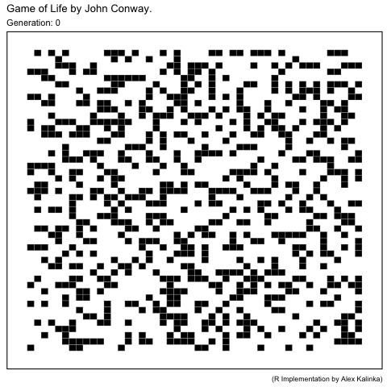

# `gameRlife`

## Summary

An `R` implementation of John Conway's cellular automata [*Game of Life*](https://en.wikipedia.org/wiki/Conway%27s_Game_of_Life).

## Dependencies

* [`R`](https://www.r-project.org/)
* [`RStudio`](https://www.rstudio.com/products/rstudio/download/)

Install the following `R` packages from within an active `R` session, e.g.

```r
install.packages("matrixcalc")
```


* `R` packages: `matrixcalc`, `dplyr`, `ggplot2
`, `gganimate`.

## Installation

From within an active `R` session:

```r
install.packages("devtools")
devtools::install_github("alextkalinka/gameRlife")
```

## Usage

### Run the Game of Life

* Use one of the in-built random seeds:

```r
gg <- game_of_life(seed_random4,
num_gens = 70,
board_size = 50)
```

This will produce the following animation:



* Use a random seed:

```r
seed <- make_seed_random(board_size = 50,
proportion_living = 0.4)
gg <- game_of_life(seed,
num_gens = 100,
board_size = 50)
```

* Define a specific seed of your own.

For example, the in-built `seed_glider` is a 5x2 matrix of living cell co-ordinates, with the first column specifying the row and the second column specifying the column:

```r
> seed_glider
     [,1] [,2]
[1,]    2    3
[2,]    3    4
[3,]    4    2
[4,]    4    3
[5,]    4    4

```

### Animate a previous game

The return object of a previous game can be animated without needing to run the simulation again:

```r
# Object 'gg' returned by the function 'game_of_life'.
animate_gol(gg)

# Just run generations 20 to 50.
animate_gol(gg, from = 20, to = 50)
```

## Bugs, issues, requests

Please contact [Alex Kalinka](mailto:alex.t.kalinka@gmail.com)

## References

Gardner, M. 1970. The fantastic combinations of John Conway's new solitaire game 'life'. *Scientific American* 223 (4): 120-123.
